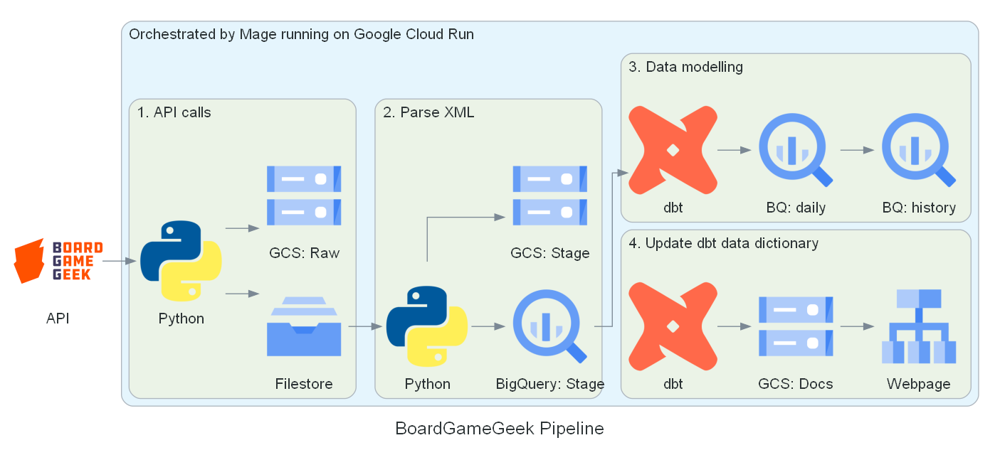

# Hey there 👋

I'm Alfred, a data enthusiast with 3+ years of experience in data analytics.

- 👀 Passionate about end-to-end data
- 🌱 Learning data engineering
- 🔭 Looking for a data engineering, analytics engineering or insights analyst role
- 📫 Contact me on [LinkedIn](https://www.linkedin.com/in/alfred-zou/)

## 🎲 [BoardGameGeek Pipeline](https://github.com/alfredzou/BoardGameGeek_Pipeline)

Please check out my end-to-end data engineering capstone project.

This pipeline extracts XML data from [BoardGameGeek's](https://boardgamegeek.com/) API, parses the XML files and saves the denormalised data into a BigQuery staging schema. Data is modelled into a star schema using dbt and saved into a daily table in the production schema. This data is then incrementally loaded into respective historical tables in the production schema. 

## 👨‍💻 Top Technologies
- SQL
- Cloud: Google Cloud Platform
- Transformations: dbt
- Orchestrator: Mage
- Language: Python
- Infrastructure as code: Terraform
- Dashboard: Tableau
- Version control: git